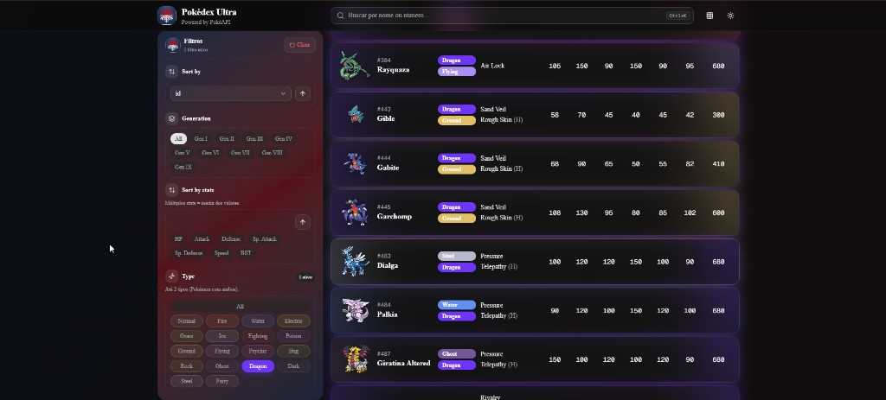
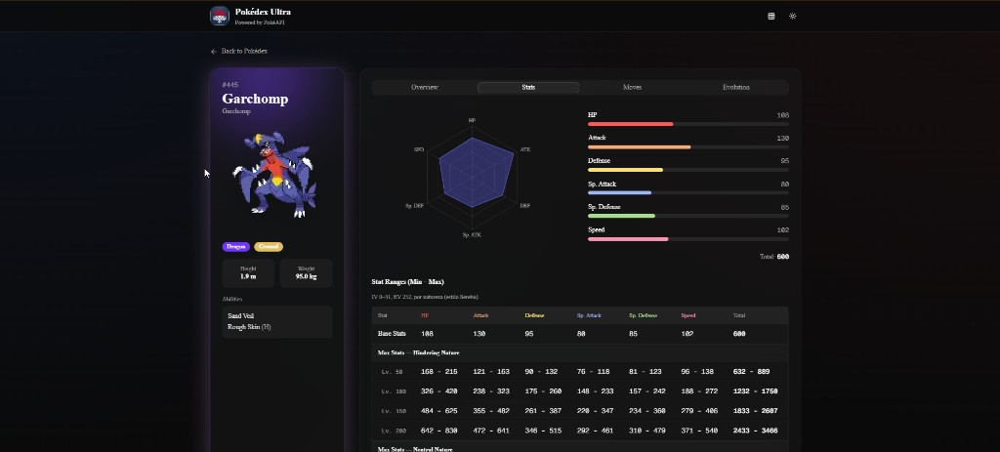

# Pokédex Ultra

Pokédex web focada em **profundidade de dados** e **ferramentas de análise** — além de listar Pokémon, ela ajuda a comparar stats, filtrar o catálogo inteiro e entender matchups, evoluções e movesets com clareza.

Dados via [PokéAPI](https://pokeapi.co/).

## Preview

**Catálogo com filtros avançados** — stats, BST, tipos e habilidades visíveis na lista; filtros por geração, tipo e ordenação por stats.



**Página de detalhe** — radar, barras de base stats e faixas min/máx por nível com naturezas.



## Por que é mais completa

A maioria das Pokédex para por nome, sprite e tipos. Aqui o catálogo funciona como uma **ferramenta de consulta**:

| Área | O que entrega |
|---|---|
| **Catálogo** | ~1.350 Pokémon em lista horizontal com stats base, BST (Base Stats Total), tipos e habilidades visíveis na mesma linha |
| **Filtros** | Tipo (até 2), geração, ordenação global e por stats (múltiplos, com média), cada uma com direção própria |
| **Busca** | Filtro em tempo real no header (`Ctrl+K`) sobre todo o catálogo |
| **Detalhe** | Overview, stats, moves, evolução e defesas por tipo — sem abas redundantes |
| **Stats** | Radar, barras, faixas min/máx por nível (50–200) e naturezas (estilo Serebii), com total por linha |
| **Type defenses** | Grid de efetividade contra os 18 tipos |
| **Moves** | Agrupados (Level Up, TM, Egg, Tutor) com tipo, categoria, power, acc e PP |
| **Evolução** | Cadeia estendida com ramificações e formas especiais |
| **Sprites** | Arte oficial ou pixel art, com toggle global |

## Funcionalidades em destaque

- Catálogo completo pré-carregado — filtros e ordenação aplicados em **todos** os Pokémon, não só na página atual
- Habilidades com descrição no hover, direto na lista
- Cards com glow animado baseado nos tipos do Pokémon
- Sidebar de filtros fixa, organizada por seções
- Tema claro/escuro

## Stack

Next.js 16 · React 19 · TypeScript · TanStack Query · Tailwind CSS 4 · shadcn/ui · Framer Motion · Recharts · PokéAPI

## Como rodar

Requisitos: **Node.js 20+** e **npm**.

```bash
git clone https://github.com/Bruno-Piter/pokedex-ultra.git
cd pokedex-ultra
npm install
npm run dev
```

Abra [http://localhost:3000](http://localhost:3000).

```bash
npm run build   # produção
npm run start   # servir build
npm run lint    # ESLint
npm run icons   # regenerar favicon e icones PWA a partir de scripts/source-icon.png
```


## Progressive Web App

Producao usa Serwist para cache do shell/assets. Em desenvolvimento o worker fica desligado.

**Como instalar o app:** Chrome/Edge (desktop) pelo icone na barra; Android pelo menu do Chrome; iOS Safari via Compartilhar > Adicionar a Tela de Inicio.

Dados da PokeAPI precisam de rede; falhas mostram erro amigavel (sem tela branca).

## Estrutura

```
src/
├── app/                 # rotas (App Router)
├── components/layout/   # header, sidebar, busca
├── features/pokemon/    # API, hooks, componentes e utils
├── lib/pokeapi/         # cliente HTTP
└── providers/           # tema, cache, artwork
```

## Autor

**Bruno Piter** — [GitHub](https://github.com/Bruno-Piter)

---

Pokémon © Nintendo / Game Freak / The Pokémon Company. Dados via [PokéAPI](https://pokeapi.co/).

